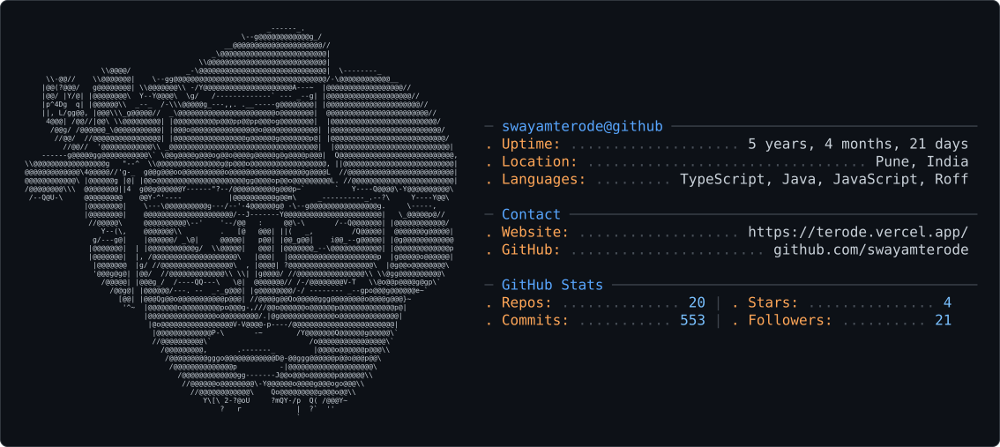

<picture>
  <source media="(prefers-color-scheme: dark)" srcset="dark_mode.svg" />
  <source media="(prefers-color-scheme: light)" srcset="light_mode.svg" />
  
</picture>

<!--
## Technology Stack

  
  

 ###  GitHub Stats

  
-->
<!--  -->

||
|----|

||
|---|

  
 

